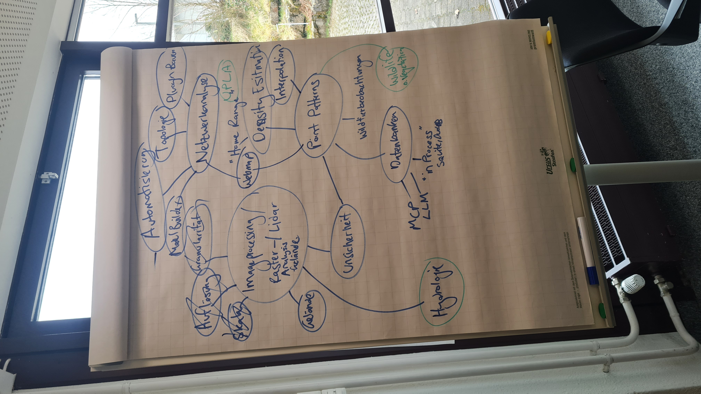

- Zentral sind die *Methods*, siehe Abbildung 1 in `meeting_prep_lecturers.pdf`
    - Davon ausgehend bestimmen wir Domains und Toolsets
    - *Multi-Criteria Analysis* wird bereits GIS Basis Modul abgedeckt
    - *Uncertainty* könnte in einem anderen Block eingeführt, und danach in den anderen Blöcken aufgegriffen werden
    - *Spatial Pattern Analysis* ist etwas nichtssagen, *Point Pattern Analysis* war hier gemeint
    - Für die Übergeordneten Themen müssen noch schönere, spannendere Begriffe / Titel gewählt werden. 

- Es kristalisieren sich folgende Themenblöcke Heraus (siehe @fig-brainstorm):

1. Block **Netzwerkanalyse**
    - Topologie, Algorithmen
    - Automatisierung: Model Designer, Skripting, QGIS Plugins Bauen
    - Thema Web Mapping (?)
    - **Domain**: Umweltplanung
2. Block **Imageprocessing / Raster Analysis**
    - DHM, Gelände, Lidar
    - Auflösung, Skalen, Granularität
    - Einführung ins Thema *Unsicherheit* (?)
    - **Domain**: Hydrologie (abstimmen mit Ökohydrologie)
3. Block **Point Patterns**
    - Density Estimation
    - Interpolation
    - Thema Unsicherheit Aufgreifen (?)
    - Thema Datenbanken (Einfach, aus Anwender-Sicht, *in Process*)
    - Thema LLM / MCP (?)
    - **Domain**: Wildtiermanagement oder Vegetationsökologie

**Nächste Schritte**:

- [x] Themen verschriftlichen
- [ ] Schöne überbegriffe finden
- [ ] Abstimmen mit Domain FGs
- [ ] Neues Meeting für Konsolidierung

## Anhang {.appendix}

{#fig-brainstorm}